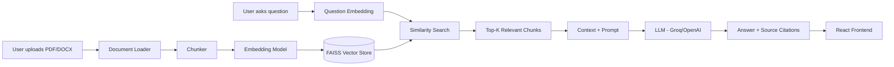

# DocuChat

DocuChat is a Retrieval-Augmented Generation (RAG) application that lets you upload PDF/DOCX documents and ask natural-language questions about them, with every answer grounded in — and cited back to — the source document and page.

Built as a portfolio project to demonstrate an end-to-end, production-shaped RAG pipeline: document ingestion, chunking, embeddings, vector search, LLM generation, source citations, and a working full-stack app around it.

---

## Architecture



**Ingestion path:** Document → Loader → Chunker → Embeddings → FAISS
**Query path:** Question → Retriever → Context → LLM → Answer + Citations

---

## Features

- Drag-and-drop PDF/DOCX upload with per-page (PDF) metadata preserved for citations
- Chunking with configurable size/overlap
- Local, free embeddings via `sentence-transformers`
- Persistent FAISS vector store (survives restarts)
- Configurable LLM provider (Groq or OpenAI) via environment variables
- Strict grounded-answer prompting — the model is instructed to say when it doesn't know, not to guess
- Source citations (filename + page) shown under every answer
- Conversational follow-up questions
- Document list with delete
- Centralized error handling, file validation, and logging
- A simple RAG evaluation script

## Tech Stack

| Layer | Choice | Why |
|---|---|---|
| Backend framework | FastAPI | Async, typed, auto-generated OpenAPI docs |
| Orchestration | LangChain | Standardizes text splitting, embeddings, and vector store interfaces |
| Embeddings | `sentence-transformers/all-MiniLM-L6-v2` | Free, runs locally, no API cost, good speed/quality tradeoff for a portfolio project |
| Vector store | FAISS | Fast, local, no external service required |
| LLM | Groq (default) / OpenAI (swappable) | Groq's free tier is fast for demos; provider is abstracted so switching is a one-line env change |
| Frontend | React + Vite | Fast dev loop, minimal boilerplate |

## RAG Pipeline (step by step)

1. **Load** — extract raw text from PDF (per page) or DOCX (whole document), preserving filename/page metadata.
2. **Chunk** — split text into ~1000-character pieces with 150-character overlap (`RecursiveCharacterTextSplitter`), so no fact is lost at a chunk boundary.
3. **Embed** — convert each chunk into a vector using a local sentence-transformer model — done once, at ingestion time.
4. **Store** — persist chunk vectors + metadata in FAISS, saved to disk so the index survives a restart.
5. **Retrieve** — embed the incoming question, run similarity search, pull back the top-K (default 4) most relevant chunks.
6. **Generate** — pass the retrieved chunks as context into a strict system prompt that forbids the model from answering outside that context.
7. **Cite** — return the answer alongside the filename/page/chunk_id of every chunk used, so the UI can show exactly where the answer came from.

---

## Installation

### Backend

```bash
cd backend
python -m venv venv
```

Activate the environment:

```bash
# macOS/Linux
source venv/bin/activate

# Windows
venv\Scripts\activate
```

Install dependencies:

```bash
pip install -r requirements.txt
```

Configure environment variables:

```bash
cp .env.example .env
# then edit .env and add your GROQ_API_KEY (https://console.groq.com — free tier available)
```

Run the server:

```bash
uvicorn app.main:app --reload
```

The API is now live at `http://localhost:8000` (docs at `http://localhost:8000/docs`).

### Frontend

```bash
cd frontend
npm install
npm run dev
```

The app is now live at `http://localhost:5173`.

---

## Environment Variables

See `backend/.env.example` for the full list. The important ones:

- `LLM_PROVIDER` — `groq` or `openai`
- `GROQ_API_KEY` / `OPENAI_API_KEY` — only the one matching `LLM_PROVIDER` is required
- `EMBEDDING_MODEL` — defaults to a free local model, no key needed
- `CHUNK_SIZE`, `CHUNK_OVERLAP`, `TOP_K` — tune retrieval behavior without touching code

---

## API Documentation

| Method | Endpoint | Description |
|---|---|---|
| GET | `/api/health` | Health check |
| POST | `/api/documents/upload` | Upload + ingest a PDF/DOCX (multipart) |
| GET | `/api/documents` | List indexed documents and chunk counts |
| DELETE | `/api/documents/{filename}` | Remove a document from the index |
| POST | `/api/chat` | Ask a question, returns `{answer, sources}` |

Full interactive docs (Swagger UI) are auto-generated by FastAPI at `/docs` once the server is running.

## Project Structure

```
docuchat/
├── backend/
│   ├── app/
│   │   ├── main.py            # FastAPI app, CORS, global error handler
│   │   ├── config.py          # Env-driven settings
│   │   ├── api/                # Route handlers (thin — delegate to services)
│   │   ├── services/           # Loader, chunker, embeddings, vector store, retriever, LLM, pipeline
│   │   ├── schemas/             # Pydantic request/response models
│   │   └── utils/                # File validation helpers
│   ├── evaluate_rag.py        # Retrieval/answer evaluation script
│   └── questions.json          # Sample evaluation set (edit for your own docs)
└── frontend/
    └── src/
        ├── components/          # FileUpload, ChatWindow, ChatMessage, SourceCard, DocumentList
        ├── services/api.js      # Fetch wrapper for the backend API
        └── App.jsx
```

## RAG Evaluation

`backend/evaluate_rag.py` runs a small evaluation set (`questions.json`) against the live index and reports:

- **Retrieval hit rate** — did the expected source document get retrieved for each question?
- **Generated vs. expected answer** — printed side-by-side for manual review

Run it after uploading the documents referenced in `questions.json`:

```bash
cd backend
python evaluate_rag.py
```

Concepts behind proper RAG evaluation (implemented here at a simple, manual level — see Future Improvements for the automated version):

- **Context precision** — of the chunks retrieved, how many were actually relevant to the question?
- **Context recall** — of all the relevant chunks that exist in the corpus, how many did retrieval find?
- **Faithfulness** — does the generated answer stay grounded in the retrieved context, without adding unsupported claims?
- **Answer relevance** — does the answer actually address what was asked?

## Future Improvements

- Hybrid search (BM25 + vector) for better keyword-heavy queries
- Reranking retrieved chunks with a cross-encoder before generation
- Streaming LLM responses token-by-token
- User authentication + multi-user document isolation
- Swap FAISS for a managed/cloud vector database (e.g., Pinecone, pgvector) for scale and proper delete support
- OCR fallback for scanned/image-only PDFs
- Automated evaluation with an LLM-as-judge (RAGAS or similar)
- LangGraph-based agentic query planning for multi-step questions

---

## Interview Prep

### Likely questions about this project

1. Why chunk documents instead of embedding the whole thing?
2. Why use overlap between chunks, and how did you pick the size/overlap values?
3. Walk me through what happens between a user typing a question and seeing an answer.
4. How do you prevent the LLM from hallucinating an answer that isn't in the documents?
5. Why FAISS instead of a managed vector database — what are the tradeoffs?
6. How does your system handle a question with no relevant matches in the corpus?
7. How would you scale this to thousands of documents / many concurrent users?
8. Why sentence-transformers for embeddings instead of an OpenAI embedding endpoint?
9. How do you evaluate whether your RAG system is actually working well?
10. What's the difference between retrieval relevance and answer correctness, and how did you measure each?

### Technical decisions to be ready to explain

- Why LangChain's `RecursiveCharacterTextSplitter` over a naive fixed-length splitter
- Why the LLM provider is abstracted behind one function (`generate_answer`) instead of calling Groq/OpenAI SDKs directly in the route handler
- Why chunk metadata (source, page, chunk_id) is stored alongside the vector, not looked up separately
- Why deletion rebuilds the FAISS index rather than deleting in place, and what that costs at scale
- Why the system prompt explicitly instructs a refusal phrase instead of letting the model improvise "I don't know"

### 2-minute interview pitch

"I built DocuChat, a RAG-based document Q&A app — you upload a PDF or DOCX, and it answers questions grounded only in that document, with citations back to the exact page. On ingestion, I extract text per page, split it into overlapping chunks with LangChain, embed each chunk locally with a sentence-transformers model, and store the vectors in a persistent FAISS index. At query time, I embed the question, retrieve the top-K most similar chunks, and pass them into an LLM — Groq by default — behind a strict prompt that forbids answering outside the retrieved context, so if the answer isn't in the documents, it says so instead of guessing. The backend is FastAPI with a clean service-layer separation — loader, chunker, embeddings, vector store, retriever, and LLM are all independent modules — and the frontend is a React app with drag-and-drop upload and a chat interface that shows source citations under every answer. I also wrote a small evaluation script that checks retrieval hit rate against a test question set, which is the first thing I'd extend if I kept building this out — probably toward hybrid search and an automated faithfulness evaluator next."
